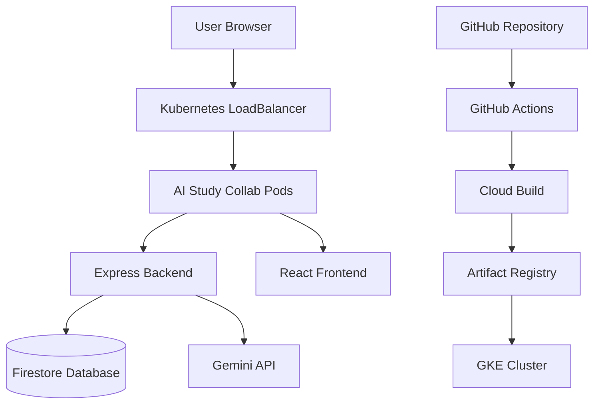

# System Architecture

## Overview

AI Study Collab is a full-stack web application that allows users to create study groups, collaborate on notes, and generate AI-assisted summaries.

## Architecture Diagram

## Component Responsibilities

### React Frontend

Responsible for:

* User registration and login
* Group management
* Note editing
* Displaying AI summaries
* Communicating with backend APIs

### Express Backend

Responsible for:

* Authentication
* Group management APIs
* Note APIs
* AI summary requests
* Socket.IO integration
* Serving the React application

### Firestore

Responsible for persistent storage of:

* Users
* Groups
* Membership information
* Notes

### Gemini API

Responsible for generating note summaries and study assistance features.

### Kubernetes

Responsible for:

* Running application replicas
* Load balancing traffic
* Managing deployments
* Restarting failed containers

### GitHub Actions

Responsible for:

* Building the application
* Running lint checks
* Building Docker images
* Deploying to Kubernetes

## Request Flow

1. User accesses the application through the browser.
2. Requests are routed through the Kubernetes LoadBalancer.
3. Traffic is forwarded to one of the running application pods.
4. Express processes API requests.
5. Data is retrieved from or written to Firestore.
6. AI requests are forwarded to Gemini.
7. Responses are returned to the frontend and displayed to the user.
